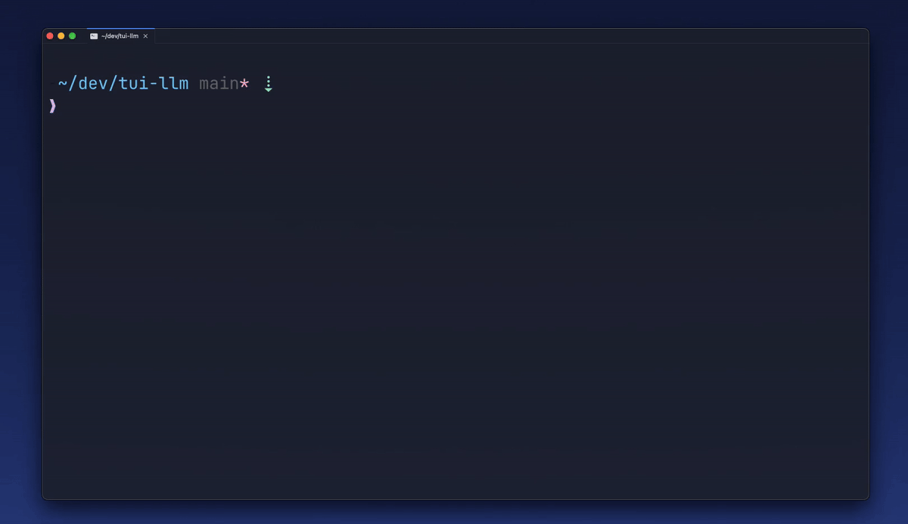

# QueQue — your terminal prompt's future

**Before:** Google it → copy → paste → tweak → pray.
**Now:** Type your intent, hit `??`, pick a command — it lands in your buffer, ready to tweak and run.

Copy-pasting commands from the browser is dead.

Welcome to the **future**.



```shell
brew install k-leumas/tap/queque
```

> [!NOTE]
> After install, run `qq init zsh >> ~/.zshrc && source ~/.zshrc` to wire up the `??` keybinding.


<details>
<summary>Install via npm</summary>

## Requirements

- zsh
- Node.js ≥ 20
- [jq](https://jqlang.github.io/jq/)


```shell
npm install -g @k-leumas/queque-cli
qq init zsh >> ~/.zshrc && source ~/.zshrc
```

</details>

## Expose API Key

QueQue resolves `ANTHROPIC_API_KEY` in order:

1. **Environment variable** — `export ANTHROPIC_API_KEY="sk-ant-..."` in your shell or `.zshrc`
2. **`.env.local` file** — place a `.env.local` in your project directory (or any parent). QueQue searches upward from the current working directory:
   ```shell
   ANTHROPIC_API_KEY=sk-ant-...
   ```

The `.env.local` option is useful for project-specific keys or keeping the key out of your shell profile.

## Usage

Type anything before `??` and QueQue turns it into a shell command:

```shell
list files by size??
find docker containers using port 3000??
git undo last commit but keep changes??
```

A selection UI opens in-terminal. Pick a command with arrow keys or fuzzy search, press `Enter`, and the command lands in your buffer — ready to run or edit before you commit.

Press `Esc` to cancel and return to what you were typing, you can even tweak your intent and hit `??` again.

### Inside Zellij

QueQue detects Zellij automatically and opens in a floating pane instead of inline. Same trigger, same result, better layout.


