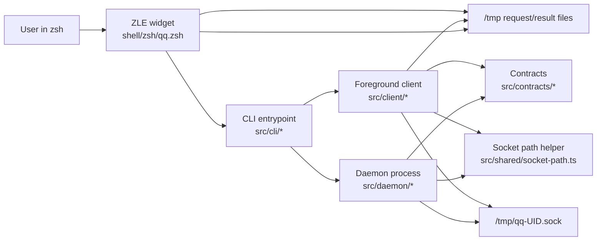
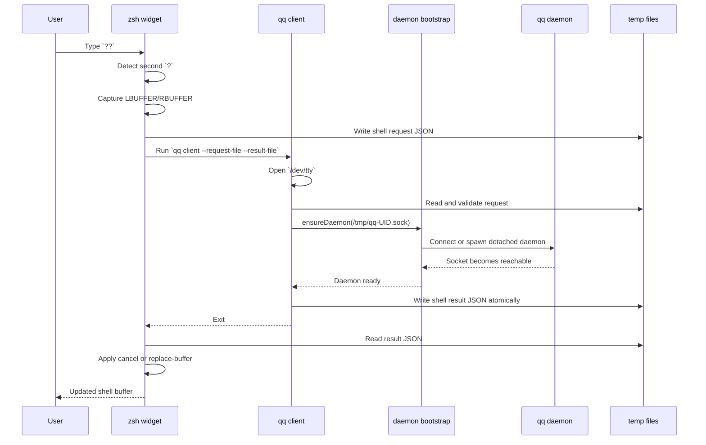
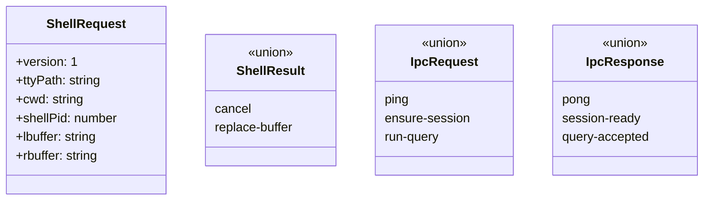
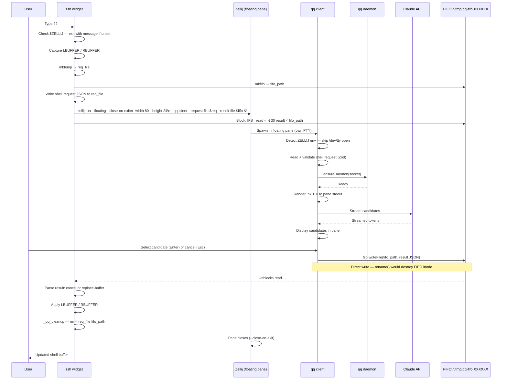
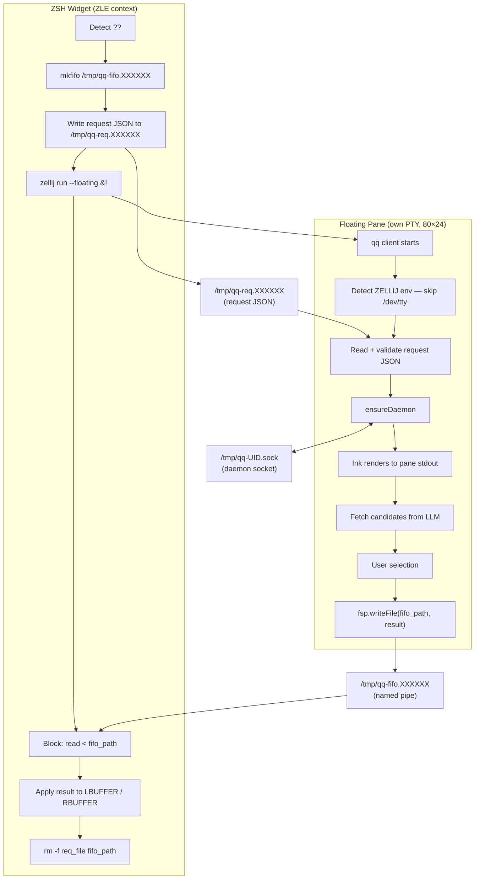
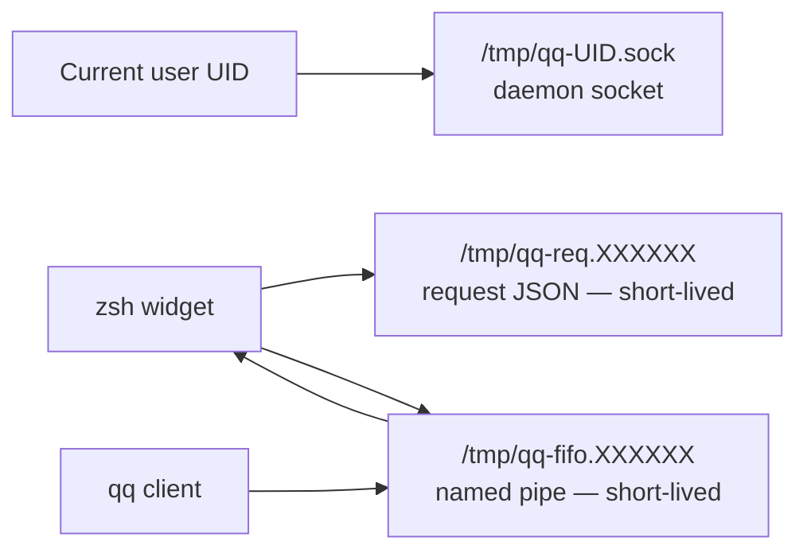

# System Design

This document describes how Que-Que is structured today, how the major pieces interact, and where the current implementation stops versus the intended end-state.

## Purpose

Que-Que is a `zsh`-integrated command helper. The intended user flow is:

1. The user types `??` inside an active shell buffer.
2. A `zsh` widget captures the shell context around the cursor.
3. The foreground `qq client` starts, ensures a background daemon exists, and runs an interactive selection flow.
4. The selected command is written back as a structured result.
5. The shell widget applies that result to `LBUFFER` and `RBUFFER` instead of executing anything directly.

Today, steps 1, 2, 4, and 5 are implemented with a deterministic seam. The interactive TUI and most daemon-side query orchestration are still placeholders.

## Main Pieces



### Annotations

- `shell/zsh/qq.zsh` is the shell-facing boundary. It owns keyboard binding, buffer capture, temp-file exchange, and buffer mutation.
- `src/cli/main.ts` is the process entrypoint and only routes commands to `client` or `daemon`.
- `src/client/run-foreground.ts` is the foreground control loop. It validates input, checks `/dev/tty`, ensures the daemon exists, and writes the final shell result.
- `src/daemon/server.ts` hosts a Unix-socket server for newline-delimited JSON IPC.
- `src/daemon/bootstrap.ts` is responsible for daemon discovery and detached startup.
- `src/contracts/shell.ts` and `src/contracts/ipc.ts` define the stable message boundaries.
- `src/shared/socket-path.ts` centralizes socket naming to avoid path drift between caller and server.

## End-To-End Interaction



### Interaction notes

- The shell and client communicate through temp files, not pipes. That keeps the contract simple and lets the shell apply the result after the client exits.
- The client and daemon communicate through a Unix socket in `/tmp`, which avoids macOS socket path length problems from long `TMPDIR` values.
- The client explicitly opens `/dev/tty` because ZLE widgets run with redirected stdin, which would break future interactive TUI input.

## Component Responsibilities

### 1. Shell Integration

File: [shell/zsh/qq.zsh](/Users/samuel/dev/tui-llm/shell/zsh/qq.zsh)

Responsibilities:

- Bind `?` in `emacs` and `viins` keymaps.
- Detect `??` without relying on `KEYTIMEOUT`.
- Capture split-buffer shell state as `lbuffer` and `rbuffer`.
- Serialize a shell request JSON file.
- Launch `qq client` attached to `/dev/tty`.
- Apply a `cancel` result by restoring original buffers.
- Apply a `replace-buffer` result by overwriting `LBUFFER` and `RBUFFER`.

Design reasons:

- Split buffers avoid cross-runtime cursor math bugs between Node string indexing and `zsh` buffer semantics.
- `jq -Rs` is used to escape shell-derived values safely during JSON generation.
- Result application treats malformed output as cancel-safe behavior.

### 2. CLI Layer

Files:

- [src/cli/main.ts](/Users/samuel/dev/tui-llm/src/cli/main.ts)
- [src/cli/commands/client.ts](/Users/samuel/dev/tui-llm/src/cli/commands/client.ts)
- [src/cli/commands/daemon.ts](/Users/samuel/dev/tui-llm/src/cli/commands/daemon.ts)

Responsibilities:

- Parse command-line options with `cac`.
- Enforce required arguments for `qq client`.
- Route to the foreground client or daemon control path.
- Keep process wiring separate from business logic.

Design reasons:

- The command handlers are intentionally thin so the foreground client and daemon can evolve independently from CLI argument parsing.

### 3. Foreground Client

Files:

- [src/client/run-foreground.ts](/Users/samuel/dev/tui-llm/src/client/run-foreground.ts)
- [src/client/result-writer.ts](/Users/samuel/dev/tui-llm/src/client/result-writer.ts)

Responsibilities:

- Read the serialized shell request.
- Validate request shape with Zod.
- Ensure the daemon is running before interactive work begins.
- Produce a shell result and write it atomically.

Current state:

- The client currently supports deterministic result modes `cancel`, `replace-buffer-fixture`, and `llm`.
- The `llm` mode asks Claude for a strict JSON command suggestion and maps it to a `replace-buffer` shell result.
- When the current directory is inside git, the prompt includes the repo root, branch, and dirty state as extra context.
- This is still a Phase 1 seam in place of the future interactive TUI.

Design reasons:

- Atomic `write -> rename` prevents the shell from observing partial JSON.
- The client remains free of Ink and React imports today, so UI can be added later without changing the shell contract.

### 4. Daemon

Files:

- [src/daemon/bootstrap.ts](/Users/samuel/dev/tui-llm/src/daemon/bootstrap.ts)
- [src/daemon/server.ts](/Users/samuel/dev/tui-llm/src/daemon/server.ts)

Responsibilities:

- Own the long-lived background process.
- Listen on a Unix socket.
- Accept newline-delimited JSON IPC requests.
- Support bootstrap behaviors such as connect-if-running, unlink stale socket, detached spawn, and readiness polling.

Current supported IPC messages:

- `ping` -> `pong`
- `ensure-session` -> `session-ready`
- `run-query` -> `query-accepted`

Current limitations:

- `run-query` only acknowledges receipt; it does not orchestrate a real query flow yet.
- Stale-socket cleanup has a documented race window if multiple callers try to ensure the daemon concurrently.

## Contracts



### Contract notes

- `ShellRequest` captures shell state at trigger time and is the boundary between `zsh` and Node.
- `ShellResult` intentionally avoids `{buffer, cursor}` to prevent Unicode cursor-position mismatch bugs.
- IPC contracts are separate from shell contracts because the daemon should not depend on shell temp-file mechanics.

## Runtime Paths

```mermaid
flowchart TD
    A[Current user UID] --> B[/tmp/qq-UID.sock]
    C[zsh widget] --> D[/tmp/qq-req-XXXXXX.json]
    C --> E[/tmp/qq-res-XXXXXX.json]
    F[client result writer] --> E
```

### Path annotations

- The daemon socket always lives in `/tmp` and follows `qq-<uid>.sock`.
- Request and result files are short-lived temp files created by the shell widget.
- Keeping the socket path short is a deliberate macOS compatibility choice.

## Phase 3.2: Zellij Floating Pane + FIFO

Phase 3.2 replaces the inline `/dev/tty` rendering path with a Zellij floating pane. The key architectural change is the result channel: instead of an atomic-rename temp file polled after the client exits, the shell widget blocks on a named pipe (FIFO) that the client writes to directly.

### End-to-End Flow



### FIFO Data Flow



### What Changed from Phase 3.1

| | Phase 3.1 | Phase 3.2 |
|---|---|---|
| Pane rendering | Inline in current terminal pane (`/dev/tty` + scroll hack) | Floating pane (`zellij run --floating`) |
| Result channel | Atomic temp file (`write .tmp → rename`) | Named pipe (`mkfifo` + direct `writeFile`) |
| Client TTY | Opens `/dev/tty` explicitly | Uses pane's own PTY (`process.stdout`) |
| Widget blocking | Polls or waits for client exit | Blocks on `read < fifo_path` |
| MODAL_CHROME_LINES | Required (scroll room for modal) | Removed (pane is its own viewport) |
| Non-Zellij behavior | Degraded inline rendering | Hard exit with message |

### Runtime Paths (Phase 3.2)



---

## Implemented vs Intended Architecture

| Area | Implemented now | Intended later |
|---|---|---|
| Shell trigger | `??` widget and buffer capture | same |
| Foreground client | request validation, `/dev/tty` check, daemon ensure, deterministic result | full interactive TUI |
| Daemon | socket server, request parsing, placeholder acknowledgements | session management, query orchestration, background state |
| Result application | cancel or replace-buffer | same contract |
| Message validation | Zod schemas for shell and IPC | same, expanded as features grow |

## Key Design Decisions

### Split buffer contract

The system passes `lbuffer` and `rbuffer` instead of a single string plus cursor index. This keeps cursor semantics owned by `zsh`, which avoids subtle Unicode and indexing mismatches across runtimes.

### Foreground client plus background daemon

The client handles the immediate shell interaction while the daemon provides a long-lived process boundary. That split is useful because interactive shell entry and background orchestration have different lifecycle and TTY requirements.

### Temp files for shell handoff

The shell widget must regain control after the client exits and then decide how to mutate the shell buffer. A file-based handoff keeps that boundary deterministic and shell-friendly.

### Socket IPC for daemon communication

The daemon is a local per-user service, so a Unix socket is simpler and safer than a TCP port. The fixed `/tmp` path also keeps discovery cheap.

## Risks And Follow-Up Work

- The daemon bootstrap has a known race around unlinking a stale socket during concurrent startup attempts.
- The daemon currently accepts `run-query` without performing real work, so the architecture is ahead of the implementation.
- The shell script depends on `jq` for JSON serialization and result parsing.
- The document name is intentionally `SYSTEM_DESGN.md` to match the requested filename, even though `SYSTEM_DESIGN.md` would be the conventional spelling.
