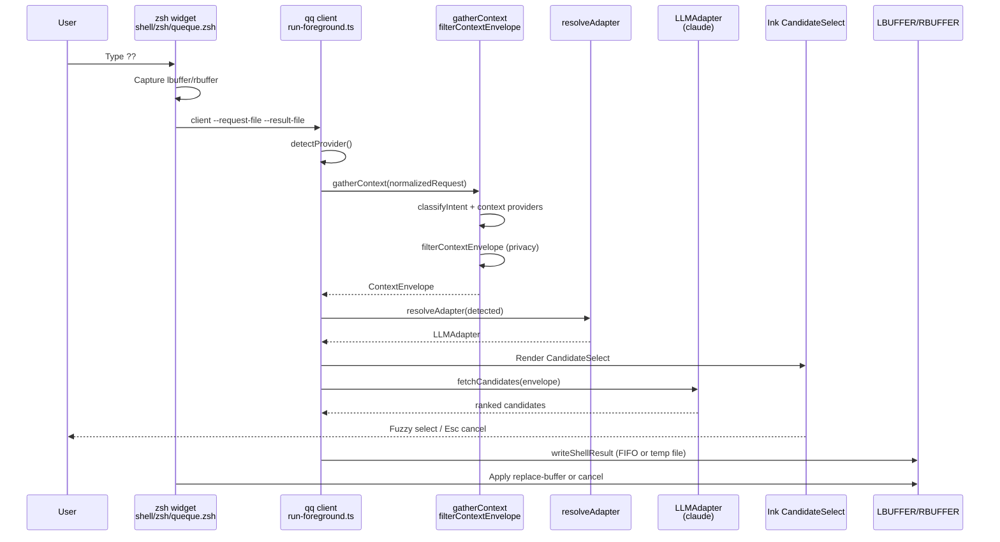
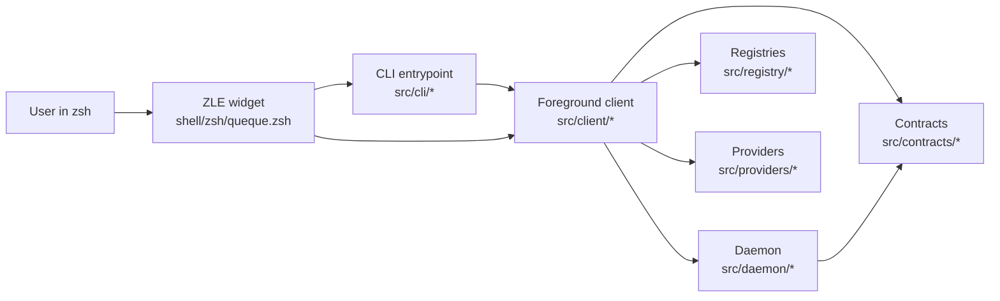
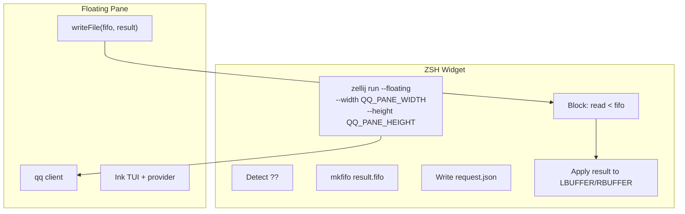

# System Design

> Last updated Phase 6 — 2026-06-18

This document describes how QueQue is structured today, how the major pieces interact, and where the current implementation stops versus the intended end-state.

## Purpose

QueQue is a `zsh`-integrated command helper. The user flow:

1. The user types `??` inside an active shell buffer.
2. A `zsh` widget captures the shell context around the cursor.
3. The foreground `qq client` starts, ensures a background daemon exists, gathers context, calls a registered provider, and runs an Ink selection TUI.
4. The selected command is written back as a structured result.
5. The shell widget applies that result to `LBUFFER` and `RBUFFER` — **insertion-only**; the user presses Enter to execute.

Steps 1–5 are fully implemented. Phase 7 adds local learning; Phase 8 adds zero-config subprocess providers (Claude CLI, Ollama, OpenAI).

## Request Flow (Phase 6)

### Privacy in the pipeline

`filterContextEnvelope` runs in `src/context/pipeline.ts` after context providers gather extras. It strips sensitive paths (`.env`, credentials, keys) from git metadata and applies again in `buildPrompt` (defense-in-depth). Debug logs redact `lbuffer`/`rbuffer` unless `QQ_DEBUG_VERBOSE=1`.

User config at `~/.config/qq/config.json` merges extra patterns onto built-in defaults. Malformed config is ignored with a warning — built-in defaults always apply.

## Main Pieces

### Annotations

- `shell/zsh/queque.zsh` — shell boundary: `??` binding, buffer capture, Zellij FIFO or inline path, result application.
- `src/cli/main.ts` — routes to `client`, `daemon`, or `init`.
- `src/client/run-foreground.ts` — request validation, daemon ensure, `gatherContext` → `resolveAdapter` → Ink TUI → result write.
- `src/context/pipeline.ts` — intent classification, registry-backed context providers, `filterContextEnvelope`.
- `src/providers/resolver.ts` — maps `detectProvider()` output to registered `LLMAdapter` instances.
- `src/providers/claude.ts` — Anthropic SDK adapter; `buildPrompt` filters envelope before prompt assembly.
- `src/registry/bootstrap.ts` — registers built-in context providers, provider backends, shell adapters, storage hooks.
- `src/daemon/server.ts` — Unix-socket server (`ping`, `ensure-session`, `run-query` acknowledgements).
- `src/ui/CandidateSelect.tsx` — fuzzy-ranked selection UI with destructive-command warnings.

## Shell Integration

File: [shell/zsh/queque.zsh](shell/zsh/queque.zsh)

Responsibilities:

- Bind `?` in `emacs` and `viins` keymaps; detect `??` without `KEYTIMEOUT`.
- Capture split-buffer state as `lbuffer` and `rbuffer`.
- **Zellij path** (when `$ZELLIJ` is set): create FIFO + request JSON, launch `zellij run --floating`, block on FIFO read.
- **Inline path** (no Zellij): foreground client writes result to temp file; widget applies after exit.
- Apply `cancel`, `replace-buffer`, or `error` results — never execute commands.

Environment variables:

| Variable | Default | Purpose |
|----------|---------|---------|
| `QQ_PANE_WIDTH` | `80` | Zellij floating pane width |
| `QQ_PANE_HEIGHT` | `24` | Zellij floating pane height |
| `QQ_DEV_ROOT` | — | Local checkout path for dev widget sourcing |
| `QQ_DEBUG_LOG_FILE` | `/tmp/qq-<uid>-debug.log` | Debug log path |
| `QQ_RESULT_FILE` | — | Set by widget for uncaughtException handlers |

Design reasons:

- Split buffers avoid Unicode cursor-index mismatches between Node and `zsh`.
- FIFO channel in Zellij avoids atomic-rename destroying the named pipe inode.
- `jq -Rs` escapes shell-derived JSON safely.

## Foreground Client

Files:

- [src/client/run-foreground.ts](src/client/run-foreground.ts)
- [src/client/result-writer.ts](src/client/result-writer.ts)

Flow in `llm` mode:

1. Read and validate shell request (Zod).
2. `detectProvider()` — pre-flight key/CLI detection.
3. `ensureDaemon(socketPath)` — warm background process.
4. `classifyIntent` → `gatherContext` → `filterContextEnvelope`.
5. `resolveAdapter(detected)` → `adapter.fetchCandidates(envelope)`.
6. Render Ink `CandidateSelect`; user selects or cancels.
7. Write `ShellResult` atomically (temp file) or directly (FIFO).

The client opens `/dev/tty` for keyboard input. In Zellij panes, `/dev/tty` refers to the pane PTY.

## Registries and Provider Resolution

Built-ins register in `src/registry/bootstrap.ts`:

| Registry | Built-in | Resolve API |
|----------|----------|-------------|
| Context providers | `git-context`, `filesystem-context` | `listContextProviders()` |
| Provider backends | `claude` (Anthropic SDK) | `getProviderAdapter()` |
| Shell adapters | `zsh` | `listShellAdapters()` |
| Storage hooks | `noop` | `listStorageHooks()` |

Provider resolution:

1. `detectProvider()` — anthropic-key → claude-cli → ollama → openai-key → none
2. `resolveAdapter(detected)` — maps to registered adapter; Phase 8 adds subprocess adapters

Production code resolves through registries — no direct adapter imports in the client path.

See [docs/EXTENSIONS.md](EXTENSIONS.md) for Phase 7 (local learning) and Phase 8 (zero-config providers).

## Zellij Floating Pane + FIFO

When `$ZELLIJ` is set, the widget uses a named pipe instead of polling a temp file:

| | Inline (no Zellij) | Zellij |
|---|---|---|
| Rendering | Inline in current terminal | Floating pane |
| Result channel | Temp file (atomic write) | Named pipe (direct write) |
| Pane size | Terminal viewport | `QQ_PANE_WIDTH` × `QQ_PANE_HEIGHT` |

## Daemon

Files:

- [src/daemon/bootstrap.ts](src/daemon/bootstrap.ts)
- [src/daemon/server.ts](src/daemon/server.ts)

The daemon listens on `/tmp/qq-<uid>.sock`. Current IPC messages: `ping`, `ensure-session`, `run-query` (ack-only). Query orchestration stays in the foreground client for now; the daemon provides a warm process boundary for future session state (Phase 7).

## Contracts

- `ShellRequest` — `lbuffer`/`rbuffer` split buffer at trigger time (shell ↔ Node boundary).
- `ShellResult` — `cancel`, `replace-buffer`, or `error`; no auto-execution.
- `ContextEnvelope` — base context + provider extras, filtered before provider calls.
- IPC contracts are separate from shell contracts.

## Runtime Paths

| Path | Purpose |
|------|---------|
| `/tmp/qq-<uid>.sock` | Daemon Unix socket |
| `/tmp/qq-sess.XXXXXX/` | Per-trigger session dir (request JSON + FIFO or result file) |
| `~/.config/qq/config.json` | Privacy/safety config (override with `QQ_CONFIG_FILE`) |

## Implemented vs Roadmap

| Area | Implemented (Phase 6) | Roadmap |
|---|---|---|
| Shell trigger | `??` widget, Zellij + inline paths | Cross-OS zsh via `qq init zsh` |
| Foreground client | Ink TUI, registry provider resolution, privacy filter | Phase 5 clarification chat (deferred) |
| Provider | Anthropic SDK via `resolveAdapter` | Phase 8: Claude CLI, Ollama, OpenAI subprocess adapters |
| Privacy | Sensitive path stripping, log redaction, config merge | Future file-read context (gated by `QQ_ALLOW_FILE_READ`) |
| Storage | `noop` hook | Phase 7: SQLite pattern index, accepted-command log |
| Daemon | Socket server, bootstrap | Phase 7: session management, cache hits |

## Key Design Decisions

### Split buffer contract

Pass `lbuffer` and `rbuffer` instead of buffer + cursor index. Cursor semantics stay owned by `zsh`.

### Insertion-only safety (CMD-04)

QueQue writes to the shell buffer; the user decides when to press Enter. No `eval`, no `accept-line` from the widget.

### Registry-first extension

New providers, context sources, and shell adapters register through `src/registry/*` without changing the client loop.

### Privacy fail-closed

Built-in sensitive patterns always apply. User config adds patterns only. Invalid `config.json` falls back to defaults.

## Risks And Follow-Up Work

- Daemon bootstrap has a known race around stale-socket unlink during concurrent startup.
- `run-query` IPC acknowledges receipt but does not orchestrate queries — foreground client owns the LLM path.
- Shell script depends on `jq` for JSON serialization and result parsing.
- Phase 8 subprocess adapters (`claude-cli`, `ollama`, `openai-key`) are detected but not yet wired.
